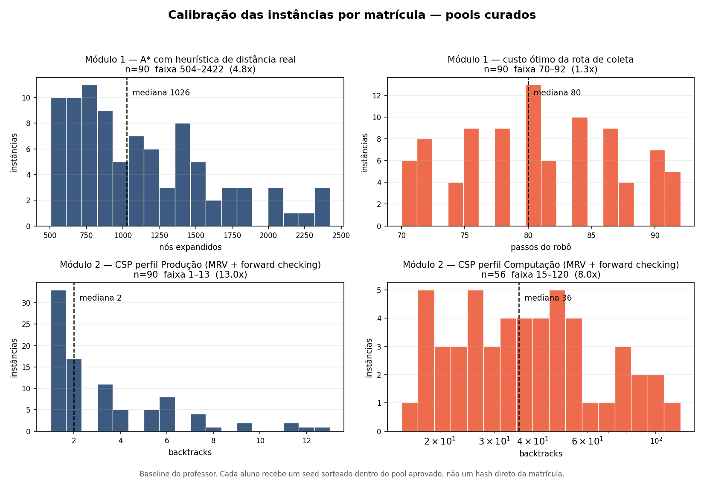

# Projeto 1 (P1) — Inteligência Artificial 1

**Valor:** 10 pontos  
**Grupos:** 3 ou 4 alunos  
**Apresentação do projeto:** 14/09/2026  
**Sessão de pôsteres:** 28/09/2026

---

## 1. O que este projeto avalia

Este projeto não avalia a implementação de código. Isso pode ser feito com
a ajuda de IA. Os algoritmos já estão prontos no repositório base e
vocês podem usá-los.

O que vale nota é projetar uma medição, prever o resultado antes de
obtê-lo, explicar por que a previsão errou e defender tudo isso oralmente
diante de quem produziu números diferentes dos seus.

Cada grupo recebe **instâncias próprias**, derivadas da matrícula do
integrante mais velho. Os números que vocês vão obter não existem em
nenhum outro lugar.

```
python3 minha_instancia.py <matricula> <producao|computacao>
```

Os pools de seeds foram curados para que nenhum grupo receba instância
significativamente mais difícil que a dos colegas. A distribuição de
dificuldade está em `histograma_calibracao.png`:



---

## 2. O contexto

Um centro de distribuição opera com robôs de picking, docas de carga e
equipes de conferência. Duas decisões acontecem ali todos os dias.

---

## 3. Módulo 1 — Busca em espaço de estados

### O problema

O robô parte da doca, coleta 8 itens espalhados pelas prateleiras e retorna
à doca. Movimentos em quatro direções, custo unitário. Alguns corredores
estão interditados.

**Estado:** posição do robô e conjunto de itens já coletados.  
**Objetivo:** todos os itens coletados e robô de volta na doca.

Isso não é caminho mínimo entre dois pontos. O espaço de estados tem
tamanho `células × 2^8`.

### Como ler a sua instância

`minha_instancia.py` imprime o mapa do armazém. Este é o da matrícula de
exemplo `20231234` (seed de busca 84). No de vocês, a doca, os itens e as
interdições ficam em outros lugares.

```
....D................
.####0####.####.####.
.####.####.#########.
.####.####.####.####.
.####.####.####.####.
.####.#########.####.
.####.####.####.####.
.............#.......
.####.####.####.####.
.####.####.####.####.
.####1####.#########.
.####.####.####2####3
4####.####5####.####.
6####.####.####.####.
....7................
```

- O armazém tem 15 linhas e 21 colunas. Uma posição é `(linha, coluna)`,
  com `(0, 0)` no canto superior esquerdo.
- `.` é corredor, por onde o robô anda. `#` é prateleira.
- Os corredores ficam nas linhas 0, 7 e 14 e nas colunas 0, 5, 10, 15 e 20.
  Um `#` no meio de um corredor é uma travessia interditada. Nesta
  instância são quatro: (2, 15), (5, 10), (7, 13) e (10, 15).
- `D` é a doca, em (0, 4). O robô sai dela e precisa voltar para ela.
- `0` a `7` são os itens. O robô coleta um item ao pisar na célula dele.
  Aqui o item 0 está em (1, 5) e o item 7 em (14, 4).
- O estado da busca é `(célula, máscara)`. A máscara tem 8 bits, e o bit
  `i` ligado significa que o item `i` já foi coletado. O estado inicial é
  `((0, 4), 0b00000000)` e o objetivo é `((0, 4), 0b11111111)`.

### O que vocês fazem

Rodem quatro estratégias já implementadas em `engine/solve_search.py`:

| Estratégia                           | Registrar                    |
| ------------------------------------ | ---------------------------- |
| Busca de custo uniforme              | nós expandidos, custo, tempo |
| A\* com heurística de Manhattan      | idem                         |
| A\* com heurística de distância real | idem                         |
| Busca gulosa                         | idem                         |

E **implementem uma heurística própria**. Uma só. Ela vai para o torneio
da turma (seção 5).

### Ênfase por curso

**Computação.** Sua heurística é admissível? Demonstre em até meia página.
É consistente? Essa é uma pergunta diferente, e a resposta muda o que A\*
precisa fazer.

**Produção.** Traduza uma restrição operacional real (prateleira bloqueada,
item prioritário, janela de coleta) e meça o impacto na rota. Responda com
número: quanto de CPU vale a pena gastar para economizar quantos passos?

---

## 4. Módulo 2 — Satisfação de restrições

### O problema

Alocar caminhões a docas e horários de início.

- **Variáveis:** um caminhão cada
- **Domínio:** pares (doca, slot de início)
- **Unárias:** janela de tempo; carga refrigerada exige doca fria
- **Binárias:** mesma doca não pode sobrepor no tempo; mesma equipe não
  pode sobrepor no tempo

Toda instância distribuída tem pelo menos uma solução, verificada na
geração.

### Como ler a sua instância

A segunda parte da saída de `minha_instancia.py` é a tabela de caminhões.
Este é um trecho da matrícula de exemplo `20231234`, curso Computação
(seed de CSP 113). A tabela completa tem 22 caminhões:

```
seed=113  docas=3 (frias=[0, 1])  slots=22
carga/capacidade = 0.89
tamanho medio de dominio = 7.5
  T0(dur=2, janela=[11,13], frio=0, eq=0)
  T1(dur=3, janela=[15,17], frio=1, eq=1)
  T2(dur=2, janela=[0,1], frio=0, eq=0)
  ...
  T15(dur=2, janela=[19,20], frio=1, eq=0)
  ...
```

- O cabeçalho diz que há 3 docas, numeradas de 0 a 2, e que as docas 0 e 1
  são refrigeradas. O dia tem 22 slots de 30 minutos, numerados de 0 a 21.
- Em `T0(dur=2, janela=[11,13], frio=0, eq=0)`:
  - `dur=2`: o caminhão ocupa a doca por 2 slots.
  - `janela=[11,13]`: ele pode **começar** no slot 11, 12 ou 13. A janela
    limita o início, não o fim: começando em 13, T0 ocupa os slots 13 e 14.
  - `frio=0`: carga comum, pode usar qualquer doca. Com `frio=1`, só as
    docas 0 e 1.
  - `eq=0`: o caminhão é conferido pela equipe 0.
- O domínio de T0 tem 3 docas × 3 inícios = 9 valores. O de T1, que é
  refrigerado, tem 2 × 3 = 6. `tamanho medio de dominio` é a média disso
  sobre os 22 caminhões.
- `carga/capacidade = 0.89` quer dizer que a soma das durações ocupa 89%
  de todos os pares (doca, slot) do dia. Quanto mais perto de 1, mais
  apertada a instância.

Um exemplo com as duas restrições unárias: T15 é refrigerado e tem janela
[19,20]. Ele só pode usar as docas 0 e 1 e começar no slot 19 ou 20, então
o domínio dele é `(0, 19)`, `(0, 20)`, `(1, 19)` e `(1, 20)`. O valor
`(1, 20)` quer dizer doca 1, começando no slot 20. A janela tem só dois
inícios porque o dia acaba: começando em 20, T15 ocupa os slots 20 e 21,
os dois últimos.

Os parâmetros do CSP mudam com o curso:

|                                | Computação | Produção |
| ------------------------------ | ---------- | -------- |
| Caminhões                      | 22         | 18       |
| Docas (as frias são a 0 e a 1) | 3          | 4        |
| Equipes                        | 3          | 5        |
| Slots no dia                   | 22         | 20       |
| Inícios possíveis por caminhão | até 3      | até 4    |

### O que vocês fazem

Seis células:

| Eixo                   | Níveis                                |
| ---------------------- | ------------------------------------- |
| Ordenação de variáveis | estática, MRV                         |
| Inferência             | nenhuma, forward checking, MAC (AC-3) |

Registrem para cada célula: atribuições, backtracks, verificações de
restrição, tempo. Configuração que não terminar em 60 segundos deve ser
reportada como **censurada**, com o tempo limite anotado. Não omitam a
linha.

Depois, **implementem uma heurística de ordenação de variáveis própria**.
Ela também vai para o torneio.

### Ênfase por curso

**Computação.** Explique por que a restrição de equipe se propaga diferente
da restrição de doca. Localize o ponto em que o custo da propagação deixa
de compensar o ganho em backtracks.

**Produção.** Aperte as janelas de tempo progressivamente e localize o
ponto de ruptura. Traduza em recomendação: quantos minutos de folga o
centro precisa manter?

---

## 5. Torneio de heurísticas

Este é o elemento que vocês não controlam.

Em **21/09** cada grupo submete dois arquivos. Em **23/09** eu rodo **todas
as submissões da turma contra as 30 primeiras instâncias do pool**, não
apenas contra a instância de origem, e publico as tabelas com os logs
completos.

### Contrato de submissão

`heuristica.py`

```python
NOME = "nome do grupo"

def make_heuristic(inst):
    # inst.depot, inst.items, inst.dist, inst.neighbors, inst.grid
    def h(cell, mask):
        return 0
    return h
```

`ordenacao.py`

```python
NOME = "nome do grupo"

def pick_var(inst, domains, unassigned):
    return unassigned[0]
```

### O que a tabela mostra

**Módulo 1:** nós expandidos na média e no pior caso, número de
contraexemplos de admissibilidade, razão entre custo encontrado e custo
ótimo.

Uma heurística agressiva e inadmissível vai expandir pouquíssimos nós e
liderar em velocidade. A coluna de otimalidade fica ao lado.

**Módulo 2:** backtracks na média e no pior caso, tempo, instâncias
censuradas.

### Política de falhas

| Evento                                                 | Consequência                         |
| ------------------------------------------------------ | ------------------------------------ |
| Exceção não tratada                                    | submissão desqualificada             |
| `h` negativa, ou `h` diferente de 0 no estado objetivo | desqualificada                       |
| Ordenação devolve variável fora de `unassigned`        | desqualificada                       |
| Mais de 20 s numa instância                            | instância censurada                  |
| Custo acima do ótimo em qualquer instância             | heurística marcada como inadmissível |

### Sobre a coluna de admissibilidade

A tabela reporta **"sem contraexemplo em 30 instâncias"**, nunca
"admissível". Não encontrar contraexemplo não prova nada. A prova é a
demonstração que vocês escrevem, e ela é cobrada na arguição.

O torneio não vale colocação. Vale 0,5 ponto pela submissão válida, e os
dados que ele gera são material obrigatório do pôster.

---

## 6. Calendário

OBS: Nenhum prazo é flexível.

| Data                 | Evento                                                                   |
| -------------------- | ------------------------------------------------------------------------ |
| **Seg 14/09**        | Apresentação. Grupos formados, seeds distribuídos, repositório publicado |
| **Qua 16/09, 23h59** | Pré-registro de hipóteses (Entrega pelo formulário no Canvas)            |
| 17 a 20/09           | Experimentação                                                           |
| **Seg 21/09, 23h59** | Submissão ao torneio (Canvas)                                            |
| Qua 23/09            | Torneio rodado. Tabelas e logs publicados (Canvas)                       |
| 24 a 26/09           | Análise cruzada e produção do pôster                                     |
| **Sáb 26/09, 23h59** | Pacote reprodutível e Pôsteres (Canvas)                                  |
| **Seg 28/09**        | Pôsteres, replicação ao vivo e arguição                                  |

Perdeu 21/09, não há torneio para o seu grupo. Não há segunda chance,
porque é uma execução coletiva única.

---

## 7. Pré-registro (16/09)

Antes de rodar qualquer experimento, o grupo entrega predições numéricas.

**A nota não vem do acerto na predição.** Vem da qualidade da análise quando a predição
erra.

Isso é literal. Predição corajosa e errada, bem explicada depois, vale mais
que predição vaga e segura. Escrever "esperamos que A\* seja melhor que
busca cega" recebe nota baixa mesmo estando certo, porque não arriscou nada
e não produziu material de análise.

Predições exigem número. "Entre 3 e 5 vezes menos nós" é predição. "Menos
nós" não é.

Entregas depois de 16/09 não serão aceitas.

---

## 8. Pacote reprodutível (26/09)

- código-fonte
- dados brutos de todas as execuções, sem filtragem
- um script único que regenera todos os números e gráficos do pôster
- `README.md` com o comando exato

No dia 28/09 um colega de outro grupo vai rodar esse script na frente de
vocês.

---

## 9. Política de uso de IA generativa

**Não há proibição para uso de IA Generativa.**

Há uma exigência de 0,5 ponto: um anexo de no máximo uma página
documentando **ao menos um caso em que a IA generativa errou e como vocês
detectaram**.

Exemplos:

- heurística sugerida que não era admissível, e o teste que revelou
- confusão entre admissibilidade e consistência
- restrição do CSP traduzida errado do enunciado
- número plausível mas inventado, que não bateu quando vocês rodaram

Grupo que entregar "a IA acertou tudo" está declarando que não verificou
nada. Isso é nota baixa, não isenção.

---

## 10. Aula de 28/09

**20 minutos.** Visitação virtual dos pôsteres, circulação livre.

**20 minutos.** Replicação ao vivo. Cada grupo recebe, sorteado na hora, o
pacote de outro grupo e um notebook. Rodam o script e conferem se os
números batem com o pôster do vizinho. Envio de formulário de quatro linhas.

Parecer negativo bem fundamentado pontua para quem audita. Parecer
complacente que deixa passar erro grave penaliza os dois grupos.

**Resto da aula.** Arguição individual, três perguntas por aluno.

Duas perguntas são sorteadas do banco público. A terceira é improvisada a
partir do seu pôster e dos seus dados:

> "Sua heurística ficou em 3º no torneio na sua instância e em 14º na
> média da turma. O que isso diz?"

> "Muda esse parâmetro e roda. O que você espera antes de apertar enter?"

Respostas podem ser dadas apontando para o pôster, escrevendo no papel ou
rodando código na hora. Avalia-se o conteúdo, não a desenvoltura.

Pôster digital no formato A1 (modelo em anexo no Canvas). Quem colocar
texto demais não vai conseguir defender.

---

## 11. Distribuição dos 10 pontos

| Componente                                 | Pontos | Tipo       |
| ------------------------------------------ | ------ | ---------- |
| Pré-registro de hipóteses                  | 1,5    | grupo      |
| Submissão válida ao torneio de heurísticas | 0,5    | grupo      |
| Pacote reprodutível                        | 1,5    | grupo      |
| Anexo de auditoria de IA                   | 0,5    | grupo      |
| Pôster e análise                           | 2,0    | grupo      |
| Ficha de replicação ao vivo                | 0,5    | grupo      |
| Arguição individual                        | 3,5    | individual |

**Multiplicador de arguição.** A nota individual também funciona como
multiplicador sobre os 6,5 pontos coletivos, variando de 0,5 a 1,0.

```
nota final = (pontos coletivos × multiplicador) + nota da arguição
```

Quem não consegue explicar o próprio trabalho não carrega a nota do grupo.

Os critérios de correção de cada componente e a tabela do multiplicador
estão em `RUBRICA.md`.

---

## 12. Ambiente técnico

- Python 3.12
- Apenas biblioteca padrão nos arquivos submetidos ao torneio
- `numpy`, `pandas` e `matplotlib` liberados para análise e gráficos
- Repositório base em `engine/`

---

## 13. Onde gastar o tempo

O erro mais provável em duas semanas (14 dias) é gastar 10 dias mexendo em código
e 4 olhando para os resultados. Inverta.

Os algoritmos estão prontos. O trabalho que vale nota é medir, comparar,
encontrar o resultado que contraria a expectativa e explicá-lo.

Três resultados bem explicados valem mais que dez tabelados.
